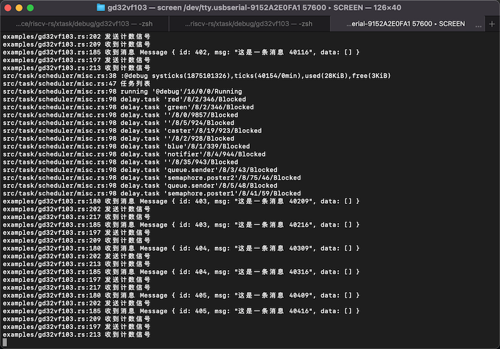
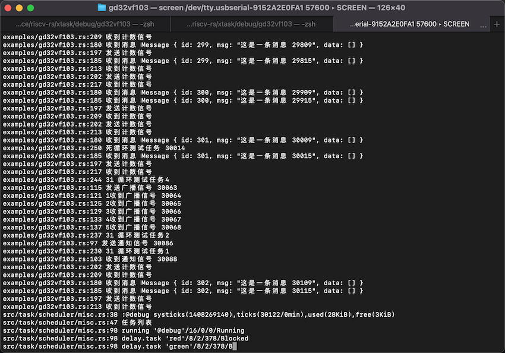

# Xtask

可移植多任务调度内核，用于嵌入式环境，与应用程序一起编译打包，参考 FreeRTOS 实现。

[多任务调度原理分析][xtask]

### 说明

1. 软件还在开发中，API 也相当原始且不稳定
2. 关于工作原理，代码（包括汇编）中有详细说明，请先阅读

### 主要功能

- [x] 单物理线程任务优先级+时间片调度机制，高优先级抢占，同优先级公平调度
- [x] 堆内存分配器
- [x] 二值信号量、计数信号量、信号广播、互斥锁、任务通知
- [x] 多生产者多消费者队列
- [x] 临界段
- [x] 栈溢出检查
- [x] PubSub 模式消息总线
- [x] 软件定时器
- [x] 驱动抽象层：编译期设备清单 + 运行期注册表，"名字就是总线"
- [x] 基于 FatFS 文件系统
- [x] 基于 smoltcp 网络协议栈

### 验证体系

- [x] 宿主回归：`cargo test --lib`(纯逻辑单测，无需硬件)
- [x] QEMU 执行级：`check.sh` 第 4 步在 virt 机真跑内核——`qemu_pingpong` 200 轮乒乓 + `qemu_kernel_tests` 13 项全内核机制自测(抢占/时间片/阻塞类 IPC/定时器/时基/堆/总线/任务回收/可重入锁)，全绿自退出
- [ ] 真机验证：gd32vf103 已验；f4/f1 常数、h7 时序、cm32m4、rp2040、ch32 系、esp32c3 待上板

### 移植的芯片

- RISCV
  - [x] GD32VF103xx
  - [x] qemu_riscv: QEMU virt 机(标准 CLINT+NS16550;**执行级验证** 2026-08-24——13 项自测 ×10 连稳定;**SMP 多核执行验证** 2026-08-26——`smp::enable()` 显式开启,从核参与调度,qemu_smp 8 项在 -smp 2/3/4/8 全绿;`TaskBuilder::affinity` 绑核确定性放置)
  - [x] CM32M4xxR(RISC-V/N308;构建级验证 2026-08-23,真机待验)
  - [x] ESP32C3: esp32c3(PAC 直依赖;构建级验证 2026-08-23,真机待验——启动需 direct boot/镜像头)
  - [x] CH32V3: ch32v307(QingKe V4F;构建级验证 2026-08-23,真机待验)
  - [x] CH32V2: ch32v203(QingKe V4B;构建级验证 2026-08-23,真机待验)
  - [x] CH32V1: ch32v103(QingKe V3A;构建级验证 2026-08-23,真机待验)
- CM7F
  - [x] STM32H7B0VBT6
- CM4F
  - [x] STM32F401CCU6
  - [x] STM32F427VIT6
  - [x] STM32F411CEU6
- CM3
  - [x] STM32F103C8T6
- CM0+
  - [x] RP2040(rp2040-hal 0.9;构建级验证 2026-08-23,真机待验)

### 快速开始

没有开发板也能跑:QEMU 执行级验证不需要任何硬件(安装 QEMU 后)

```bash
cargo build --example qemu_kernel_tests --features qemu_riscv,timer --target riscv32imac-unknown-none-elf --release
qemu-system-riscv32 -M virt -nographic -bios none -kernel \
  target/riscv32imac-unknown-none-elf/release/examples/qemu_kernel_tests
# 期望输出 13/13 passed,进程以退出码 0 自行结束

# SMP 多核执行验证(应用 smp::enable() 后从核参与调度):
cargo build --example qemu_smp --features qemu_riscv,timer --target riscv32imac-unknown-none-elf --release
qemu-system-riscv32 -M virt -smp 2 -nographic -bios none -kernel \
  target/riscv32imac-unknown-none-elf/release/examples/qemu_smp
# 期望输出 smp PASS: 8/8(双核并行/跨核唤醒/锁与堆压力/节拍推进/绑核放置/定时器跨核)
# 同一 ELF 支持 -smp 2..8(核数梯度回归:-smp 2/3/4/8 全绿)
```

如果您有一块 longan-nano 或者 stm32f401ccu6 或者 stm32f103c8t6 最小系统板，那么[example](https://github.com/gqf2008/xtask/tree/master/examples)中的例子直接可以跑起来



1. 打开一个终端

   - cd debug/gd32vf103
   - ./openocd.sh

2. 串口调试

   - 把调试器插到 usb 口
   - window 平台需要你找一款串口助手连接串口即可
   - linux 或者 mac 平台执行 screen /dev/$串口设备 57600

3. 打开另外一个终端

   - [x] gd32vf103: --target riscv32imac-unknown-none-elf
   - [x] stm32f4: --target thumbv7em-none-eabihf
   - [x] stm32f1: --target thumbv7m-none-eabi
   - [x] rp2040: --target thumbv6m-none-eabi(rp2040-hal 0.9 复活;构建级验证 2026-08-23,真机待验)
   - [x] qemu_riscv: QEMU virt 机(标准 CLINT+NS16550;**执行级验证**——见上文"验证体系")

   - 信号广播示例

     - cargo run --example broadcast --features=gd32vf103 --target riscv32imac-unknown-none-elf --release

   - LED 示例，三个任务分别控制三色 LED

     - cargo run --example led --features=gd32vf103 --target riscv32imac-unknown-none-elf --release

   - 多任务切换示例，5 个任务，4 个任务循环一段时间后退出

     - cargo run --example multitask --features=gd32vf103 --target riscv32imac-unknown-none-elf --release

   - 通知示例，一个通知另外一个

     - cargo run --example notify --features=gd32vf103 --target riscv32imac-unknown-none-elf --release

   - 队列示例，两个发，三个收消息

     - cargo run --example queue --features=gd32vf103 --target riscv32imac-unknown-none-elf --release

   - 信号量示例，两个发，三个收

     - cargo run --example semaphore --features=gd32vf103 --target riscv32imac-unknown-none-elf --release

   - 消息服务总线示例，

     - cargo run --example evbus --features=gd32vf103 --target riscv32imac-unknown-none-elf --release

   - 软件定时器
     - cargo run --example timer --features=gd32vf103,timer --target riscv32imac-unknown-none-elf --release

4. 如果您能在终端看到任务工作时的日志输出，恭喜您已经成功了

### 移植层接口

```rust

/// 移植层接口定义
pub trait Portable {
    /// 完全内存屏障
    /// 保证在屏障之前的任何存储操作先于屏障之后的代码执行。
    fn barrier();
    /// 临界区保护函数
    fn free<F, R>(f: F) -> R
    where
        F: FnOnce(&CriticalSection) -> R;
    /// 开全局中断
    fn enable_interrupt();
    /// 关全局中断
    fn disable_interrupt();
    /// 启动调度器
    fn start_scheduler() -> !;
    /// 软中断
    fn irq();
    /// 关闭软中断
    fn disable_irq();
    /// 获取systick
    fn systick() -> u64;
    /// 硬件延时，单位us
    fn delay_us(us: u64);
    /// 保存任务环境到任务栈
    fn save_context(task: &mut Task);

    // ---- SMP 扩展面(第 25 章改造路线②③,全部带单核默认实现)----
    /// 当前核(hart)ID——SMP 口按 mhartid;单核口恒 0(默认)
    fn hart_id() -> u16 {
        0
    }
    /// 参与调度的物理核数——单核恒 1(默认)
    fn core_count() -> u16 {
        1
    }
    /// 向指定核发软中断(IPI)——默认退化为本核 irq();SMP 口按目标核寻址
    fn irq_to(hart: u16) {
        let _ = hart;
        Self::irq();
    }
    /// 启动从核参与调度——单核默认空操作;多核口唤醒停泊的从核
    fn start_secondary_cores() {}
}

```

[xtask]: Xtask.md
