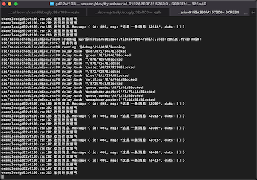
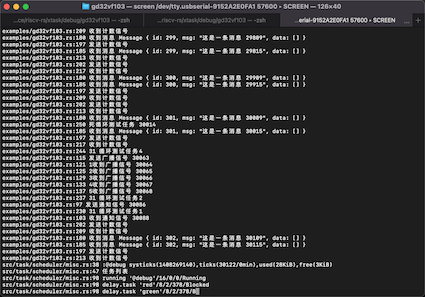

# xtask

可移植多任务调度中间件，用于嵌入式环境，与应用程序一起编译打包，参考FreeRTOS实现。  

### 说明

1. 软件还在开发中，API也相当原始且不稳定
2. 关于工作原理，代码（包括汇编）中有详细的说明，请先阅读下
3. 如果您有任何建议、想法可以通过提交[issues](https://github.com/gqf2008/xtask/issues)或者通过邮箱(gao.qingfeng#gmail.com)联系到我
4. 如果您有兴趣参与这个项目请提交您的PR

### 主要功能  

- [x] 单物理线程任务优先级+时间片调度
- [x] 堆内存分配器
- [x] 二值信号量、计数信号量、信号广播
- [x] 多生产者多消费者队列  
- [x] 临界段 
- [x] 栈溢出检查 
- [x] PubSub模式消息总线
- [x] 软件定时器 

### 移植的芯片  

- [x] GD32VF103xx
- [x] CM4F(STM32F401CCU6)
- [ ] CM3
- [ ] CM0
- [ ] CM7
- [ ] CH32V3
- [ ] CH32V2
- [ ] CH32V1

### 快速开始

如果您有一块longan-nano或者stm32f401ccu6最小系统板，那么[example](https://github.com/gqf2008/xtask/tree/master/examples)中的例子直接可以跑起来



1. 打开一个终端
    - cd debug/gd32vf103
    - ./openocd.sh

2. 串口调试
    - 把调试器插到usb口
    - window平台需要你找一款串口助手连接串口即可
    - linux或者mac平台执行 screen /dev/$串口设备 57600

3. 打开另外一个终端
    - 信号广播示例
        - cargo run --example broadcast --release --all-features

    - LED示例，三个任务分别控制三色LED
        - cargo run --example led --release --all-features

    - 多任务切换示例，5个任务，4个任务循环一段时间后退出
        - cargo run --example multitask --release --all-features

    - 通知示例，一个通知另外一个
        - cargo run --example notify --release --all-features

    - 队列示例，两个发，三个收消息
        - cargo run --example queue --release --all-features

    - 信号量示例，两个发，三个收
        - cargo run --example semaphore --release --all-features

    - 消息服务总线示例，
        - cargo run --example evbus --release --all-features

    - 软件定时器
        - cargo run --example timer --release --all-features
        
4. 如果您能在终端看到任务工作时的日志输出，恭喜您已经成功了


### 移植层接口

```rust

/// 移植层接口定义
pub trait Portable {
    /// 完全内存屏障
    /// 保证在屏障之前的任何存储操作先于屏障之后的代码执行。
    fn barrier();
    /// 临界区保护函数
    fn free<F, R>(f: F) -> R
    where
        F: FnOnce(&CriticalSection) -> R;
    /// 开全局中断
    fn enable_interrupt();
    /// 关全局中断
    fn disable_interrupt();
    /// 启动调度器
    fn start_scheduler() -> !;
    /// 软中断
    fn irq();
    /// 关闭软中断
    fn disable_irq();
    /// 获取systick
    fn systick() -> u64;
    /// 硬件延时，单位us
    fn delay_us(us: u64);
    /// 保存任务环境到任务栈
    fn save_context(task: &mut Task);
}

```
